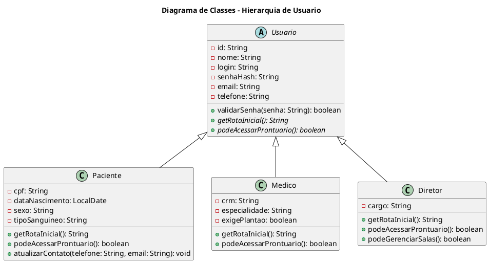

# Diagrama de Classes — Hierarquia de Usuário (`Paciente`, `Médico` e `Diretor`)

```plantuml
@startuml
title Diagrama de Classes - Hierarquia de Usuario

abstract class Usuario {
  - id: String
  - nome: String
  - login: String
  - senhaHash: String
  - email: String
  - telefone: String
  + validarSenha(senha: String): boolean
  + {abstract} getRotaInicial(): String
  + {abstract} podeAcessarProntuario(): boolean
}

class Paciente {
  - cpf: String
  - dataNascimento: LocalDate
  - sexo: String
  - tipoSanguineo: String
  + getRotaInicial(): String
  + podeAcessarProntuario(): boolean
  + atualizarContato(telefone: String, email: String): void
}

class Medico {
  - crm: String
  - especialidade: String
  - exigePlantao: boolean
  + getRotaInicial(): String
  + podeAcessarProntuario(): boolean
}

class Diretor {
  - cargo: String
  + getRotaInicial(): String
  + podeAcessarProntuario(): boolean
  + podeGerenciarSalas(): boolean
}

Usuario <|-- Paciente
Usuario <|-- Medico
Usuario <|-- Diretor
@enduml
```
